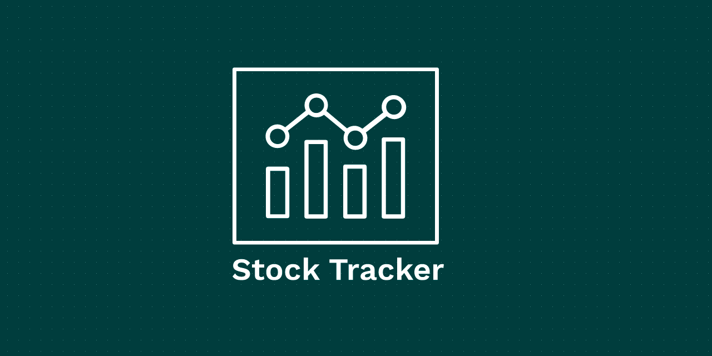
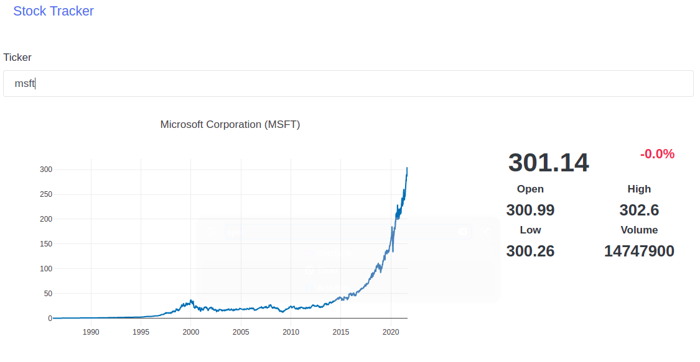

## Project Overview
Stock Tracker is an interactive data visualization application developed in Python, with the help of [Dash](https://github.com/plotly/dash) , [yfinance](https://pypi.org/project/yfinance/) and [Pandas](https://github.com/pandas-dev/pandas)

## Features
It uses yfinance to get intraday trading data of any [NASDAQ](https://www.nasdaq.com/) listed company.  
It takes the ticker symbol of that company as input and price fluctuations till current date are plotted on an interactive graph provided by plot.ly.
Other than displaying current price, open price, high, low and volume of that stock, it also calculates percentage change of price in the last one-day interval.  
The interface is created using [Litera](https://bootswatch.com/litera/), a bootstrap theme from [Bootswatch](https://bootswatch.com/).

## Demo & Screenshot
  


## Techstack
* Python
* Dash
* Plot.ly
* Docker
* yfinance

## Setup
### Pre-requisites
Install [docker](https://www.docker.com/) and [docker-compose](https://docs.docker.com/compose/).

### Steps
1. Change directory to `docker`.

```bash
cd docker
```
2. Build docker service `stock-tracker` using docker compose.

```bash
docker-compose build
```

3. Start docker service

```bash
docker-compose up
```

4. Visit `localhost:8050` in your web browser.

## License
[MIT](LICENSE)